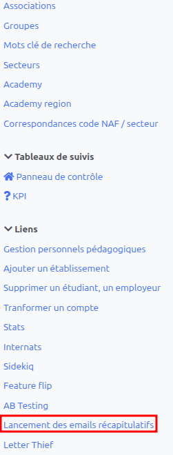
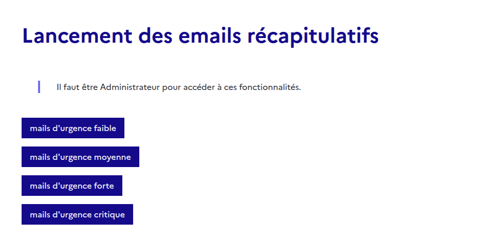
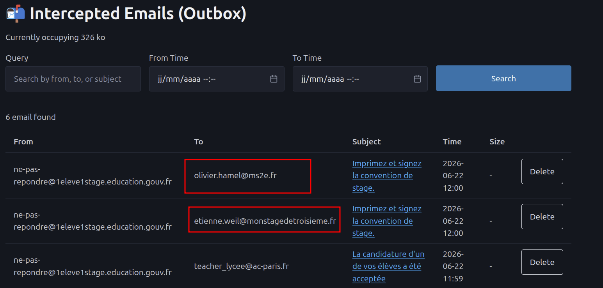
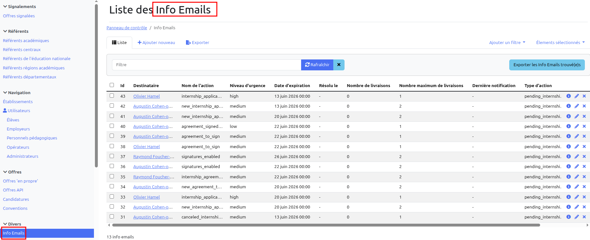

# QA — Emails récapitulatifs pour les employeurs

## Objectif

Dérouler manuellement, **via l'interface** (front élève + front employeur,front chef
d’établissement et boîte mail Letter Thief), les scénarios à vérifier lors du déclenchement
des emails récapitulatifs (digest emails) pour l’ employeur, et vérifier que chaque action
métier produit bien le bon comportement .

Important : L’interface technique MailActionItem **(interface A)** peut être consultée, mais
ce n’est pas obligatoire. Elle est détaillée en annexe. Seul compte la réception ou non des
emails récapitulatifs et leur contenu le cas échéant.

## Le déclenchement des emails récapitulatifs [interface B]

Les emails récapitulatifs sont lancés par cron, autrement dit automatiquement à une heure
et un moment de la semaine prédéfini

- les mails récapitulatifs d’importance faible (**low**) : 2 fois par semaines le lundi et le
jeudi à 08h00
- les mails récapitulatifs d’importance moyenne (**medium**) : tous les jours à 08h00 du lundi au vendredi
- les mails récapitulatifs d’importance forte (**high**) : 2 fois par jour à 8h et 13h du lundi au vendredi
- les mails récapitulatifs d’importance critique (**critical**) : toutes les 4h du lundi au vendredi sauf la nuit.

Une telle fréquence rend la recette difficile. C’est pourquoi une interface spécifique,
permettant de déclencher n’importe lequel de ces mails récapitlatifs par urgence, a été
fournie à l’équipe de recette Elle donne l’autonomie à l’équipe le temps de la recette,
mais en temps normal, on n’en a pas l’usage.

<table>
<colgroup>
<col style="width: 25%;">
<col style="width: 75%;">
</colgroup>
<thead>
<tr>
<th>Gauche</th>
<th>Dans un autre onglet</th>
</tr>
</thead>
<tbody>
<tr>
<td></td>
<td></td>
</tr>
</tbody>
</table>

Attention à bien être administrateur au moment d’utiliser ces boutons !

### Spécificités des niveaux d’urgence

- le niveau low embarque avec lui toutes les notifications de niveau supérieur (medium, high, critical)
- le niveau medium embarque avec lui toutes les notifications de niveau supérieur (high, critical)
- le niveau high embarque avec lui toutes les notifications de niveau supérieur (critical)
- le niveau critical ne cible que les notifications d’urgence critique (aujourd’hui sans
objet)

### Letter Thief [interface C]

Cette interface, comme mail_trap auparavant, réunit les emails pour tous les destinataires
à un seul endroit, c’est ici qu’on doit trouver les emails récapitulatifs

#### Conseils pour la recette

- Disposer de plusieurs browsers différents avec ou sans fenêtre privée pour se loguer
avec différents rôles afin d’éviter d’avoir à se déconnecter et se reconnecter sans
cesse.
- Bien partir du départ , à savoir de la candidature élève plutôt que sur des données de
seed.

## Scénario A — Nouvelle candidature

1. **Élève** : se connecter, rechercher une offre, postuler.
2. Déclencherl’email récapitulatif d’urgence moyenne (medium) dans interface B.
3. **Employeur** : ouvrir la boîte mail Letter Thief [interface C], vérifier la réception d’un
mail de digest ou mail récapitulatif mentionnant la nouvelle candidature.
4. Mémoriser l’adresse du lien contenu dans l’email (ou sur le bouton) , par un clic droit
(“copier l’adresse du lien”)
5. Coller l’’adresse du lien dans un browser où l’employeur est déjà logué
6. Vérifier l’arrivée sur la page de la candidature.

## Scénario B — Candidature lue puis annulée par l'élève

1. **Élève** : postuler à l’offre.
2. **Employeur** : se connecter, ouvrir/consulter la candidature dans son tableau de bord
(pour la marquer comme lue).
3. **Élève** : annuler la candidature depuis son espace.
4. **Déclencher** l’email récapitulatif d’urgence moyenne (medium) (interface B).
5. **Employeur** : vérifier la réception du mail récapitulatif et la mention de la
“candidature annulée” dans la boîte mail [interface C].
6. **Re-déclencher** l’email récapitulatif d’urgence moyenne (medium) (interface B).
7. Aucun email n’est envoyé.

## Scénario C — Candidature jamais lue puis annulée par l'élève

1. **Élève** : postuler à l'offre.
2. **Employeur** : ne PAS ouvrir la candidature.
3. **Élève** : annuler la candidature.
4. **Déclencher** le mail récapitulatif de niveau moyen.
5. **Employeur** : vérifier qu'**aucun** email récapitulatif d'annulation ou de candidature n'est reçu

## Scénario D — Candidature restaurée après annulation

### D1. Lue → annulée → restaurée (mail attendu)

1. **Élève** : postuler.
2. **Employeur** : ouvrir la candidature.
3. **Élève** : annuler puis restaurer la candidature depuis son espace.
4. **Déclencher** le mail récapitulatif de niveau moyen.
5. **Employeur** : vérifier la réception du mail de restauration. Il doit y avoir un message de candidature, mais rien sur l'annulation/restauration

### D2. Jamais lue → annulée → restaurée (pas de mail)

1. **Élève** : postuler.
2. **Employeur** : ne pas ouvrir la candidature.
3. **Élève** : annuler puis restaurer la candidature.
4. **Déclencher** le mail récapitulatif de niveau moyen.
5. **Employeur** : vérifier qu'**aucun** mail de restauration n'est reçu, mais que la candidature est signalée dans le récapitulatif

### D3. Lue → annulée → restaurée → ré-annulée avant le digest

1. Reprendre les étapes du D1 jusqu'à la restauration.
2. **Élève** : annuler à nouveau la candidature, avant de déclencher le digest.
3. **Déclencher** le mail récapitulatif de niveau moyen.
4. **Employeur** : vérifier qu'**aucun** mail récapitulatif avec une section restauration n'est reçu.

## Scénario E — Confirmation d'annulation par l'élève (urgence haute)

1. **Élève** : postuler, puis engager le flux d'annulation jusqu'à
   confirmation explicite ("confirmer l'annulation").
2. **Déclencher** le mail récapitulatif de niveau fort .
3. **Employeur** : vérifier la réception du mail correspondant, marqué comme
   urgent dans son contenu/objet.

## Scénario F — Cycle de vie d'une convention de stage

1. **Employeur/Élève** : générer une convention de stage à compléter pour la
   candidature acceptée.
2. **Déclencher** le mail récapitulatif de niveau moyen, vérifier le mail "convention à compléter".
3. Compléter la convention, la faire signer par une première partie (élève ou
   responsable légal).
4. **Déclencher** le mail récapitulatif de niveau moyen, vérifier le mail "convention à signer" /
   "signée par une autre partie" reçu par l'employeur.
5. **Employeur** : signer la convention à son tour (dernière signature
   manquante).
6. **Déclencher** le mail récapitulatif de niveau moyen : aucun email ne doit être envoyé.
   - L'item `agreement_to_sign` est résolu (l'employeur a signé).
   - L'item `agreement_signed_by_all` créé par la dernière signature est également
     résolu (l'employeur sait qu'il vient de signer : pas besoin de le notifier).

### F2 — Élève signe en premier (cas particulier)

1. **Élève** : signer la convention avant l'employeur.
2. **Déclencher** le mail récapitulatif de niveau moyen.
3. **Employeur** : vérifier que le mail récapitulatif contient bien la section "Conventions de
   stage à signer" avec le nom de l'élève et un lien "Voir la convention".

## Scénario G — Absence de notification

1. **Employeur** : se connecter avec un compte de test sans aucune action en
   attente (aucune candidature/convention/offre récente).
2. **Déclencher** les quatre digests (critical, high, medium, low).
3. Vérifier qu'**aucun** mail récapitulatif n'est reçu pour ce compte.

## Scénario H — Regroupement multi-niveaux

1. Préparer simultanément, pour le même employeur :
   - une offre dépubliée (low),
   - une nouvelle candidature (medium),
   - une confirmation d'annulation (high).
2. **Déclencher** le mail récapitulatif de niveau bas.
3. **Employeur** : vérifier que le mail reçu regroupe bien les actions de niveau
   égal ou supérieur (low + medium + high), sans doublon avec un digest de
   niveau inférieur déjà envoyé précédemment.

## Check-list de fin de session

- [ ] Tous les mails attendus ont bien été reçus, avec le bon contenu et les
      bons liens de redirection vers l'interface.
- [ ] Aucun mail inattendu n'a été reçu (cas de résolution silencieuse).
- [ ] Les liens contenus dans les mails amènent bien sur les bonnes pages de
      l'application (candidature, convention, offre).
- [ ] La mise en forme des mails (urgence, regroupement d'actions) est correcte
      visuellement.

## Annexe

### L'interface technique MailActionItem

**Nom de l’action** : quelle est l’information à envoyer

**Niveau d’urgence** : low, medium, high et potentiellement critical, mais on n’a pas de cas
prévu de cette urgence là. Ce nombre est fixé dans un fichier
“mail_action_configurable.rb”

**Date d’expiration** : il y a une date de péremption pour chaque action qui est de 40 jours par
défaut ou la date de début de stage moins 2 jours ; **on filtre les emails action items relatifs à 
n’envoie pas de mail récapitulatif avec des informations périmées**

**Résolu le** : si une date est renseignée, alors cette ligne va disparaitre juste **avant** le
prochain appel du traitement d’envoi des récapitulatifs emails

**Nombre de livraisons** : nombre de fois où l’information a été envoyée

**Nombre maximum de livraisons** : nombre de fois maximal où l’information doit être
envoyée. Ce nombre est fixé dans un fichier “mail_action_configurable.rb”

==> Si le nombre de livraisons égale le nombre maximal de livraisons alors, l’information ne
fera **pas** partie des informations du prochain email récapitulatif

---

NB: la prochaine US à recetter MGF-1684 contient une évolution qui permet de modifier
les valeurs du fichier “mail_action_configurable.rb” de façon interactive