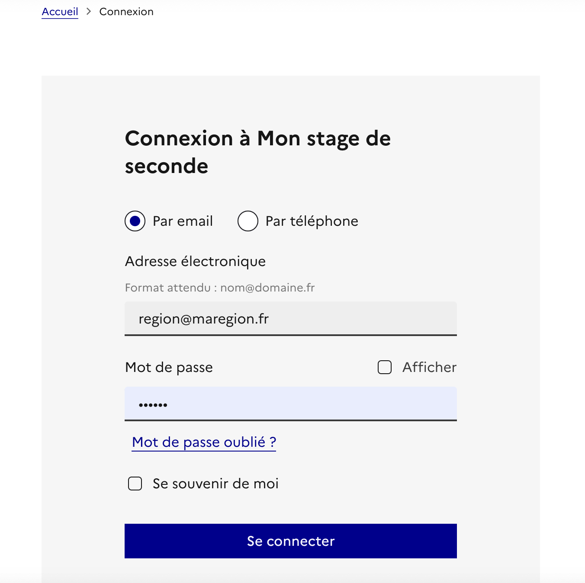
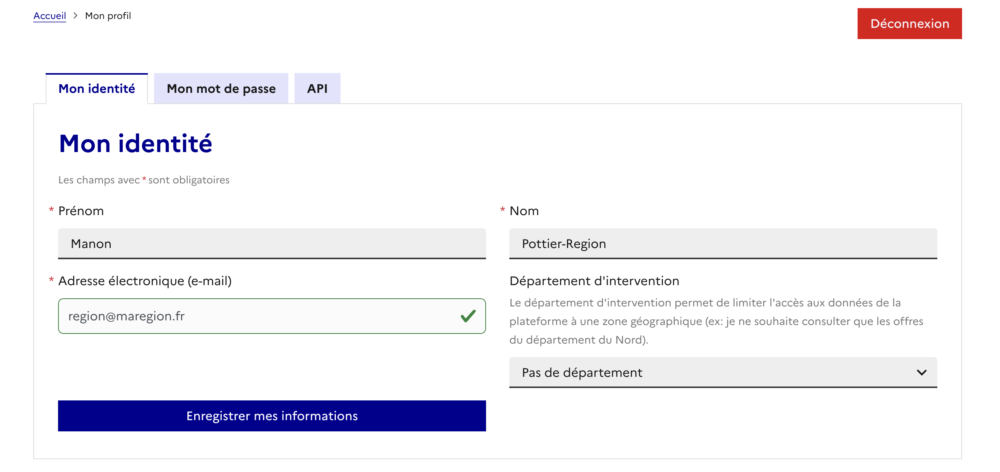

Pour diffuser des offres sur la plateforme [Mon stage de seconde](https://stagedeseconde.1jeune1solution.gouv.fr/), une API est mise à disposition pour :

* les associations
* les collectivités
* les ministères
* les partenaires

Il s'agit d'une API REST qui permet les opérations suivantes :
- Ajouter une offre de stage sur Mon stage de seconde
- Modifier une offre de stage sur Mon stage de seconde
- Supprimer une offre de stage sur Mon stage de seconde
- Récupérer ses offres de stage postées sur Mon stage de seconde
- Rechercher des offres de stage sur Mon stage de seconde

# Table des matières
- [Environnements](#environnements)
- [Authentification](#authentification)
- [Structures de données et référentiels](#structures-de-données-et-référentiels)
  - [Swagger](#swagger)
  - [Offres de stage](#offres-de-stage)
  - [Secteurs d'activité](#secteurs-dactivité)
- [Gestion d'erreurs](#gestion-derreurs)
- [Endpoints](#endpoints)
  - [Création d'une offre](#ref-create-internship-offer)
  - [Récupérer mes offres](#ref-index-internship-offer)
  - [Recheche d'offres](#ref-search-internship-offer)
  - [Modification d'une offre](#ref-modify-internship-offer)
  - [Suppression d'une offre](#ref-destroy-internship-offer)
- [Premiers pas et exemples](#premiers-pas-et-exemples)


# Environnements
L'api est disponible sur ```/api``` sur les environnements de pré production et de production. Soit les ```baseURL``` suivantes
  * En pré production : https://stagedeseconde.recette.1jeune1solution.gouv.fr/api
  * En production : https://stagedeseconde.1jeune1solution.gouv.fr/api

# Authentification

*Les APIs sont ouvertes uniquement aux acteurs concernés.*

**Merci d'effectuer une demande par mail** ([support](mailto:contact@stagedeseconde.education.gouv.fr)) pour créer un compte API.

Une fois le compte créé, le token d'API pourra être récupéré via notre interface web. Il est différent selon l'environnement de pré production ou production.

L'authentification se fait par token via le header HTTP : ```Authorization: Bearer #{token} ```

Ce token devra être présent à chaque requête.

### Comment récuperer mon token d'authentification

[Se connecter](https://stagedeseconde.1jeune1solution.gouv.fr/utilisateurs/connexion) avec votre compte opérateur



Depuis la page [Mon profil](https://stagedeseconde.1jeune1solution.gouv.fr/mon-compte), se rendre sur la page API



Depuis la page [API](https://stagedeseconde.1jeune1solution.gouv.fr/mon-compte/api), récupérer le token


# Structures de données et référentiels

## Swagger
Pour tester l'API et comprendre son fonctionnement un [swagger](https://app-e29a97fc-5386-434f-bf9d-8f813c68f838.cleverapps.io/docs/) est disponible.

## Offres de stage

Les offres de stages décrits ci-dessous décrivent les offres réservées aux classes de seconde générales et technologiques.

```
{
  internship_offer: {
    title : Titre de l’offre de stage
    description : Description de l'offre de stage

    employer_name : Nom de l’entreprise proposant le stage
    employer_description : Description de l’entreprise proposant le stage
    employer_website : Lien web vers le site de l’entreprise proposant le stage

    coordinates : Coordonnées géographique du lieu du stage
    street : Nom de la rue ou se déroule le stage
    zipcode  : Code postal ou se déroule le stage
    city : Nom de la commune où se déroule le stage

    sector_uuid : Identifiant unique du secteurs, voir référentiel *(1)
    period: Durée du stage (voir ci-dessous)

    remote_id: l'identifiant unique du coté operateur|collectivité|association
    permalink: lien de redirection pour renvoyer sur le site unique du coté operateur|collectivité|association
    max_candidates: le nombre de candidat possible sur ce stage
    published_at: date de publication de l'offre
    is_public: Secteur public ou privé
  }
}
```
### <a name="ref-period"></a>
## Période de stage

L'API attend en paramètre obligatoire la durée du stage qui peut être :
* Plein temps - du 17 au 24 juin 2024 : **0**,
* Semaine 1 - du 17 au 21 juin 2024 : **1**,
* Semaine 2 - du 24 au 28 juin 2024 : **2**

### <a name="ref-sectors"></a>
## Secteurs d'activité

L'API attend en paramètre obligatoire un secteur d'activité associé à une offre. Voici la *liste* ainsi que leurs **identifiants uniques**.

* *Agroéquipement*: **s1**,
* *Architecture, urbanisme et paysage*: **s2**,
* *Armée - Défense*: **s3**,
* *Art et design*: **s4**,
* *Artisanat d'art*: **s5**,
* *Arts du spectacle*: **s6**,
* *Audiovisuel*: **s7**,
* *Automobile*: **s8**,
* *Banque et assurance*: **s9**,
* *Bâtiment et travaux publics (BTP)*: **s10**,
* *Bien-être*: **s11**,
* *Commerce et distribution*: **s12**,
* *Communication*: **s13**,
* *Comptabilité, gestion, ressources humaines*: **s14**,
* *Conseil et audit*: **s15**,
* *Construction aéronautique, ferroviaire et navale*: **s16**,
* *Culture et patrimoine*: **s17**,
* *Droit et justice*: **s18**,
* *Édition, librairie, bibliothèque*: **s19**,
* *Électronique*: **s20**,
* *Énergie*: **s21**,
* *Enseignement*: **s22**,
* *Environnement*: **s23**,
* *Filiere bois*: **s24**,
* *Fonction publique*: **s25**,
* *Hôtellerie, restauration*: **s26**,
* *Immobilier, transactions immobilières*: **s27**,
* *Industrie alimentaire*: **s28**,
* *Industrie chimique*: **s29**,
* *Industrie, ingénierie industrielle*: **s30**,
* *Informatique et réseaux*: **s31**,
* *Jeu vidéo*: **s32**,
* *Journalisme*: **s33**,
* *Logistique et transport*: **s34**,
* *Maintenance*: **s35**,
* *Marketing, publicité*: **s36**,
* *Mécanique*: **s37**,
* *Métiers d'art*: **s38**,
* *Mode*: **s39**,
* *Papiers Cartons*: **s40**,
* *Paramédical*: **s41**,
* *Recherche*: **s42**,
* *Santé*: **s43**,
* *Sécurité*: **s44**,
* *Services postaux*: **s45**,
* *Social*: **s46**,
* *Sport*: **s47**,
* *Tourisme*: **s48**,
* *Traduction, interprétation*: **s49**,
* *Verre, béton, céramique*: **s50**

Exemple de ce que nous attendons donc un uuid dans nos API :

```
internship_offer.sector_uuid: "s33"
```

### <a name="ref-daily-hours"></a>
## Horaires quotidiens
Les stages se déroulant sur une semaine du lundi au vendredi, il est possible de préciser les horaires de chaque journée de la façon suivante :

```
{ JOUR: [HEURE_DEBUT, HEURE_FIN] }
```

Exemple de ce que nous attendons dans nos API :

```
internship_offer.daily_hours: { "lundi": ["8:30";"17:00"], "mardi": ["8:30";"17:00"], "mercredi": ["8:30";"17:00"], "jeudi": ["8:30";"17:00"], "vendredi": ["8:30";"17:00"]}
```

# Gestion d'erreurs
Les erreurs de requête seront signalées via un code HTTP > 400.

Sur chaque requête, on pourra avoir les erreurs suivantes :

- 400, Bad Request : Paramètres de requête mal renseignés. Exemple : Secteur non indiqué dans la création d'une offres
- 401, Unauthorized : Token invalide
- 403, Forbidden : Pas le droit d'effectuer cette requête. Exemple : Modification d'une offre qui ne vous appartient pas
- 422, Unprocessable Entity. Payload incorrect (impossible de traiter la requête car le format ne correspond pas). Ou la donnée n'est pas valide

- 500, Internal Server Error : Service indisponible

En plus de ses erreurs transverses, les erreurs spécifiques à un appel seront détaillées pour chacun d'entre eux.


# Endpoints

### <a name="ref-create-internship-offer"></a>
## Création d'une offre


**url** : ```#{baseURL}/internship_offers```

**method** : POST

*Paramètres de body :*

* **internship_offer.title** *(string, required)*
* **internship_offer.description** *(text, required *<= 500 caractères)
* **internship_offer.employer_name** *(string, required)*
* **internship_offer.employer_description** *(string, required *<= 275 caractères)
* **internship_offer.employer_website** *(string, optional)*
* **internship_offer.coordinates** *(object/geography, optional)* : { "latitude" : 1, "longitude" : 1 }
* **internship_offer.street** *(text, optional)*
* **internship_offer.zipcode** *(string, required)*
* **internship_offer.city** *(string, required)*
* **internship_offer.sector_uuid** *(integer, required)*
* **internship_offer.period** *(integer, required)*
* **internship_offer.lunch_break** *(string, optional)*: le détail de la pause déjeuner
* **internship_offer.daily_hours** *(object, optional)*: Les horaires de chaque jour. ex: {"lundi": ['9:00', '16:00], "mardi": ['9:00', '16:00], "mercredi": ['9:00', '16:00], "jeudi": ['9:00', '16:00], "vendredi": ['9:00', '16:00]}
* **remote_id** *(string, required)*: l'identifiant unique du coté operateur|collectivité|association
* **permalink** *(url, required)*
* **max_candidates** *(integer)*
* **is_public** *(boolean, optional)*: true|false
* **lunch_break** *(text, optional *<= 500 caractères)
* **daily_hours** *(object, optional, 

### Exemple curl

``` bash
curl -H "Authorization: Bearer $API_TOKEN" \
     -H "Accept: application/json" \
     -H "Content-type: application/json" \
     -X POST \
     -d '{"internship_offer": {"title":"title","description":"description","employer_website":"http://google.fr","street":"Tour Effeil","zipcode":"75002","city":"Paris","employer_name":"employer_name", "employer_description":"employer_description","remote_id":"test_2","permalink":"https://www.google.fr","sector_uuid": "1ce60ecc-273d-4c73-9b1a-2f5ee14e1bc6", "coordinates":{"latitude":1.0,"longitude":1.0}}}' \
     -vvv \
     $ENV/api/internship_offers
```

### Erreurs

- 409, Conflict. Une offre avec le même ```remote_id``` existe déjà

### <a name="ref-index-internship-offer"></a>
## Récupérer mes offres


**url** : ```#{baseURL}/internship_offers```

**method** : GET

### Exemple curl

``` bash
curl -H "Authorization: Bearer $API_TOKEN" \
     -H "Accept: application/json" \
     -H "Content-type: application/json" \
     -vvv \
     $ENV/api/internship_offers
```

### Erreurs

- 409, Conflict. Une offre avec le même ```remote_id``` existe déjà

### <a name="ref-search-internship-offer"></a>
## Recherche d'offres

**url** : ```#{baseURL}/internship_offers/search```

**method** : GET

*Paramètres d'url**

* **latitude** *(float, optional)* : 1
* **longitude** *(float, optional)* : 1
* **radius** *(integer, optional)* : le rayon de recherche en mètres
* **keyword** *(string, optional)* : les mot-clés à rechercher dans le titre et la description des offres

### Exemple curl

``` bash
curl -H "Authorization: Bearer $API_TOKEN" \
     -H "Accept: application/json" \
     -H "Content-type: application/json" \
     -X GET \
     -d '{"latitude": 44.8624,
          "longitude": -0.5848,
          "radius": 10000,
          "keyword": "avocat"
          }'
     -vvv \
     $ENV/api/internship_offers/search
```


### <a name="ref-modify-internship-offer"></a>
## Modification d'une offre


**url** : ```#{baseURL}/internship_offers/#{remote_id}```

**method** : PATCH

*Paramètres d'url* :

* **remote_id** *(string, required)*
* **internship_offer.title** *(string)*
* **internship_offer.description** *(text,  <= 500 caractères)*
* **internship_offer.employer_name** *(string)*
* **internship_offer.employer_description** *(string, <= 275 caractères)*
* **internship_offer.employer_website** *(string)*
* **internship_offer.coordinates** *(object/geography)* : { "latitude" : 1, "longitude" : 1 }
* **internship_offer.street** *(text)*
* **internship_offer.zipcode** *(string)*
* **internship_offer.city** *(string)*
* **internship_offer.sector_uuid** *(integer)*
* **internship_offer.period** *(integer)*
* **permalink** *(url)*
* **max_candidates** *(integer)*
* **is_public** *(boolean, optional)*: true|false
* **published_at** *(datetime.iso8601(0))* : voir [reference](https://ruby-doc.org/stdlib-2.6.1/libdoc/date/rdoc/DateTime.html#method-i-iso8601)

Note : La dépublication s'opère en passant null dans le paramètre published_at

### Exemple curl

``` bash
curl -H "Authorization: Bearer $API_TOKEN" \
     -H "Accept: application/json" \
     -H "Content-type: application/json" \
     -X PATCH \
     -d '{"internship_offer": {"title":"Mon offre de stage", "description": "Description..."}}' \
     -vvv \
     $ENV/api/internship_offers/$remote_id
```

### Erreurs

- 404, Not Found. Aucune offre n'a été trouvée avec le ```remote_id``` spécifié
- 422, Unprocessable Entity. Aucun paramètre n'a été spécifié pour la modification

### <a name="ref-destroy-internship-offer"></a>
## Suppression d'une offre
**url** : ```#{baseURL}/internship_offers/#{remote_id}```

**method** : DELETE

*Paramètres d'url* :

* **remote_id** *(string, required)*

### Exemple curl

``` bash
curl -H "Authorization: Bearer foobarbaz" \
     -H "Accept: application/json" \
     -X DELETE \
     -vvv \
     https://monstagedetroisieme.fr/api/internship_offers/#{job_irl_id|vvmt_id|myfuture_id|provider_id...}
```

### Erreurs

- 404, Not Found. Aucune offre n'a été trouvée avec le ```remote_id``` spécifié


# Premiers pas et exemples

Pour éprouver nos APIs, nous utilisons des [scripts shell](https://github.com/betagouv/monstagedeseconde/tree/master/doc/requests/internship_offers/).


C'est un moyen simple pour tester votre token et nos APIs.

``` bash
git clone https://github.com/betagouv/monstagedeseconde.git
cd monstagedeseconde
cd doc
cp env.sample env.sh
```

Vous pouvez maintenant configurer votre environnement (pre-production/production) et votre token en editant le fichier ```env.sh```

```
set -x

# usage: rename env.sample env.sh

MONSTAGEDESECONDE_ENV=https://stagedeseconde.1jeune1solution.gouv.fr/api
MONSTAGEDESECONDE_TOKEN=foobarbaz
```


## Création d'une offre

* exemple d'appel à l'api : ```./requests/internship_offers/create.sh```
* exemple de reponse, cf: ./output/internship_offers/create/*
* exemple de payload, cf: ./input/internship_offers/create.json

## Mise à jour d'une offre
* exemple d'appel à l'api : ```./requests/internship_offers/update.sh```
* exemple de reponse, cf: ./output/internship_offers/update/*
* exemple de payload, cf: ./input/internship_offers/update.json

## Suppression d'une offre
* exemple d'appel à l'api : ```./requests/internship_offers/destroy.sh```
* exemple de reponse, cf: ./output/internship_offers/destroy/*
